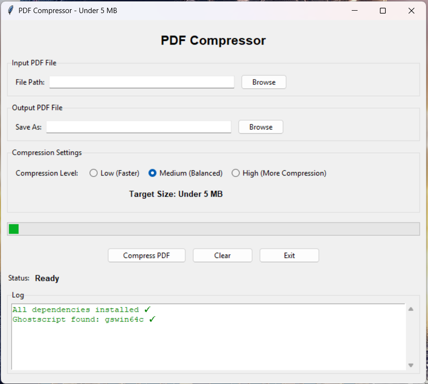

# 📄 Python PDF Compressor

A lightweight desktop application built with **Python** to compress PDF files while maintaining document quality. The application provides a simple graphical interface and supports multiple compression levels using **Ghostscript** and **PyPDF**.

---

## 📷 Preview



---

## ✨ Features

- 📄 Compress PDF files through a simple desktop GUI
- ⚡ Three compression modes (Low, Medium, High)
- 📁 Select input and output files easily
- 📊 Display compression progress and logs
- 📉 Show file size reduction percentage
- 🔍 Automatically detect Ghostscript installation
- 🛡 Fallback compression using PyPDF when Ghostscript is unavailable
- 💻 Lightweight Windows desktop application

---

## 🛠 Built With

- Python
- Tkinter (ttk)
- Ghostscript
- PyPDF
- Pillow
- ReportLab

---

## 📦 Installation

Clone this repository

```bash
git clone https://github.com/damarazky/python-pdf-compressor.git
```

Install dependencies

```bash
pip install -r requirements.txt
```

Run the application

```bash
python main.py
```

---

## 📂 Project Structure

```text
python-pdf-compressor/
│
├── assets/
│   ├── screenshot-main.png
│   ├── screenshot-result.png
│   └── logo.png
│
├── main.py
├── requirements.txt
├── icon.ico
├── README.md
└── LICENSE
```

---

## 🚀 How It Works

1. Select a PDF file.
2. Choose the destination file.
3. Select the compression level.
4. Click **Compress PDF**.
5. Wait until the process is complete.
6. View the compression result.

---

## 📈 Compression Modes

| Mode | Description |
|------|-------------|
| Low | Faster compression with better quality |
| Medium | Balanced between quality and file size |
| High | Maximum compression for smaller file size |

---

## 📌 Requirements

- Python 3.10+
- Ghostscript (Recommended)
- Windows

---

## 👨‍💻 Author

**Damar Azky**

Information Systems Student

GitHub: https://github.com/damarazky

Instagram: https://instagram.com/idkdj0626

---

## 📄 License

This project is licensed under the MIT License.